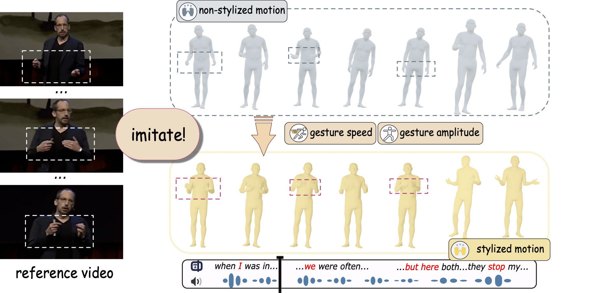

# PDF 转图片指南

## 为什么需要转换？

虽然 `<embed>` 标签可以显示 PDF，但有以下问题：
1. 在某些浏览器中可能无法正常显示
2. 移动端支持不好
3. 加载速度较慢
4. 不符合极简风格（会有PDF工具栏）

**推荐方案**：将 PDF 转换为 PNG/JPG 图片

## 🔧 转换方法

### 方法1: macOS 预览（最简单）

1. 用"预览"打开 PDF 文件
2. 点击菜单栏 `文件` → `导出`
3. 格式选择 `PNG`
4. 分辨率设为 `300 像素/英寸` 或更高
5. 保存为 `poster.png` / `main.png` 等

### 方法2: Adobe Acrobat

1. 打开 PDF
2. `文件` → `导出到` → `图像` → `PNG`
3. 选择导出质量（高质量）
4. 保存

### 方法3: 在线工具（免费）

推荐网站：
- **PDF2PNG.com** - https://pdf2png.com/zh/
- **iLovePDF** - https://www.ilovepdf.com/zh-cn/pdf_to_jpg
- **Smallpdf** - https://smallpdf.com/cn/pdf-to-jpg

步骤：
1. 上传 PDF
2. 选择转换为 PNG（推荐）或 JPG
3. 下载转换后的图片

### 方法4: 命令行（高级）

#### 使用 ImageMagick
```bash
# 安装（如果还没安装）
brew install imagemagick

# 转换（高质量）
convert -density 300 poster.pdf -quality 90 poster.png

# 如果PDF有多页，只转第一页
convert -density 300 poster.pdf[0] -quality 90 poster.png
```

#### 使用 Ghostscript
```bash
# 安装
brew install ghostscript

# 转换
gs -dNOPAUSE -dBATCH -sDEVICE=png16m -r300 -sOutputFile=poster.png poster.pdf
```

## 📝 转换后的操作

1. **重命名文件**：
   - `poster.pdf` → `poster.png`
   - `main.pdf` → `main.png`
   - `advanced_MotionLCM.png` 已经是图片，不需要转换

2. **更新 HTML**：
   ```html
   <!-- 改之前 -->
   <embed src="images/poster.pdf" type="application/pdf">
   
   <!-- 改之后 -->
   
   ```

3. **删除 PDF 文件**（可选）：
   转换完成后可以删除原 PDF，节省空间

## ⚙️ 推荐设置

转换时的最佳参数：
- **格式**: PNG（支持透明背景，质量更好）
- **分辨率**: 300 DPI
- **宽度**: 1500-2000px
- **颜色模式**: RGB

## 🎨 优化建议

转换后如果图片太大（> 2MB），可以：

1. **在线压缩**：
   - TinyPNG - https://tinypng.com/
   - Squoosh - https://squoosh.app/

2. **本地压缩**：
   ```bash
   # 使用 ImageMagick 压缩
   convert poster.png -quality 85 -resize 1800x poster-compressed.png
   ```

## 当前文件状态

需要转换的文件：
- ✅ `images/advanced_MotionLCM.png` - 已经是图片，不需要处理
- ⚠️ `images/poster.pdf` - 需要转换为 PNG
- ⚠️ `images/main.pdf` - 需要转换为 PNG

转换完成后，你的网页会：
- ✅ 加载更快
- ✅ 所有浏览器完美兼容
- ✅ 移动端友好
- ✅ 保持极简风格
